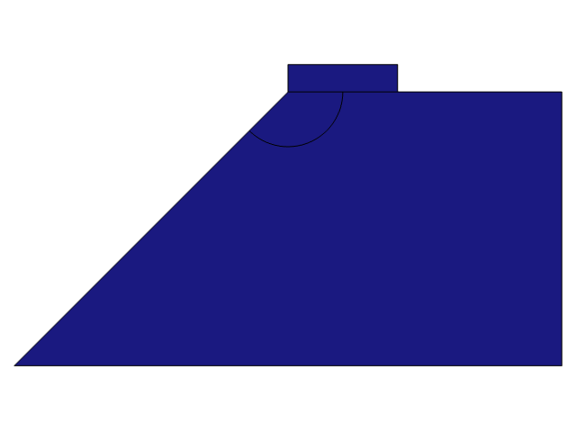

# An efficient phase-field model of shear fractures using deviatoric stress split

We propose a phase-field model of shear fractures using the deviatoric stress decomposition (DSD). This choice allows us to use general three-dimensional Mohr-Coulomb's (MC) failure function for formulating the relations and evaluating peak and residual stresses. We apply the model to a few benchmark problems of shear fracture and strain localization and report remarkable performance. Our model is able to capture conjugate failure modes under biaxial compression test and for the slope stability problem, a challenging task for most models of geomechanics.

For more details, please check out our paper at: [https://arxiv.org/abs/2303.07309](https://arxiv.org/abs/2303.07309)

## Triaxial Compression


Remark 1: The code would generate a coarse mesh. For better accuracy, use a much finer mesh, according to the details presented in our paper.
## Slope Stability


Remark 2: The code would generate a coarse mesh. For better accuracy, use a much finer mesh, according to the details presented in our paper.

Remark 3: There are two solution steps, with first being the gravity loading. The second step relies on the solution from the first step.


## How to use
To use the java codes, you need to first compile them with COMSOL's built-in java compiler. First you need to located COMSOL's installation directory, and then:

On MacOS/Linux:
``` bash
/Applications/<COMSOL-VER>/Multiphysics/bin/comsol compile /full/path/to/***.java
```

On Windows:
```bash
C:\Program Files\<COMSOL-VER>\Multiphysics\bin\win64\comsolcompile C:\full\path\to\***.java
```

Compiling these java codes should generate a java binary `***.class` which then you can open in COMSOL.
These codes are tested using COMSOL > v6.0, however most portions should be supported in earlier versions with minor adjustments.
## Reference
If you found our work helpful, please cite us:

```
@article{haghighat2023efficient,
  title={An efficient phase-field model of shear fractures using deviatoric stress split},
  author={Haghighat, Ehsan and Santill{\'a}n, David},
  journal={arXiv preprint arXiv:2303.07309},
  url={https://arxiv.org/abs/2303.07309},
  year={2023}
}
```
